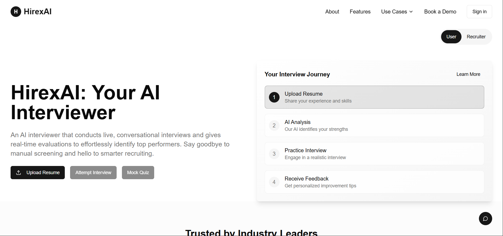
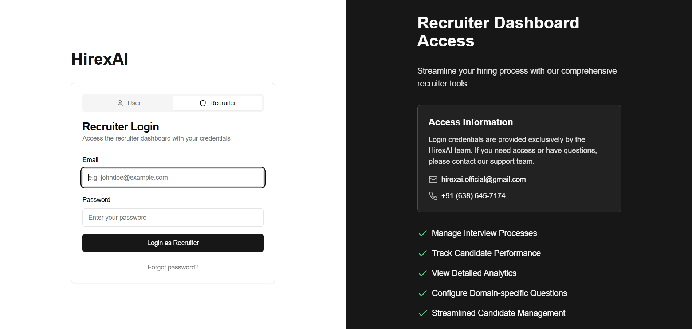
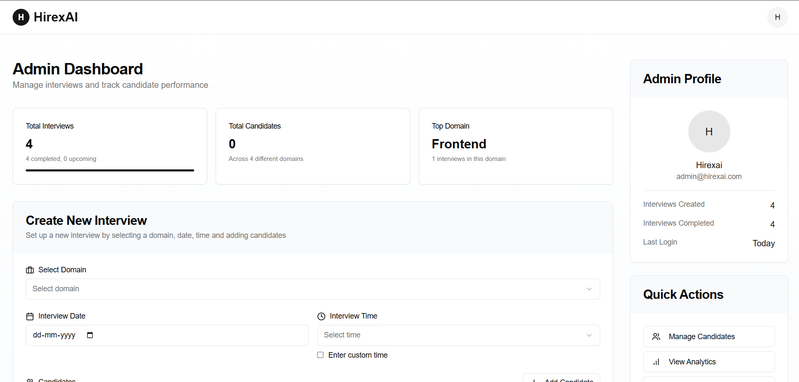
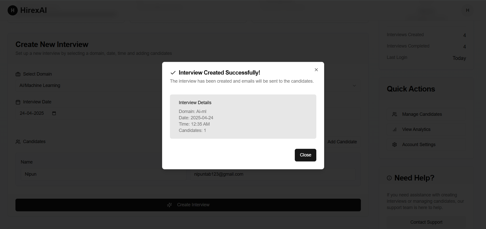
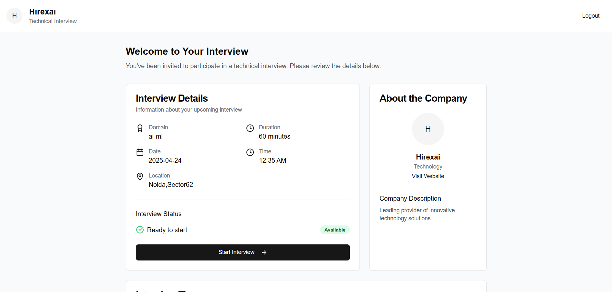
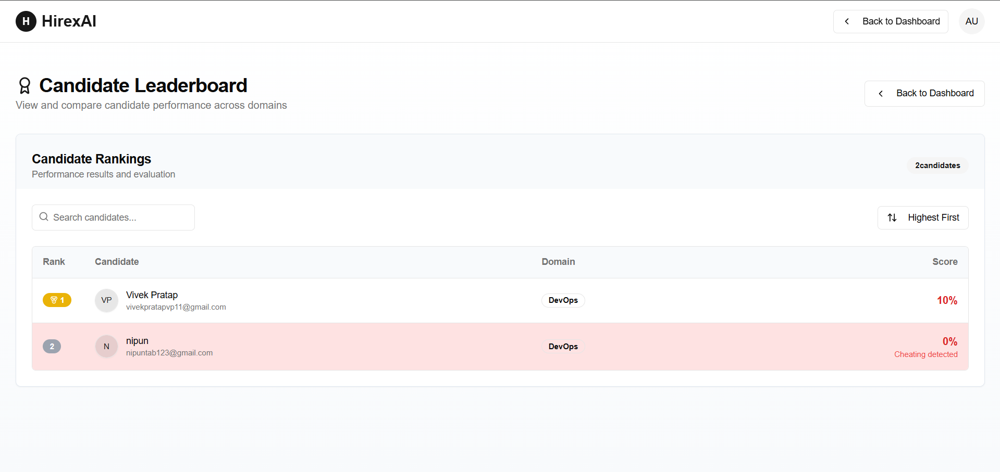
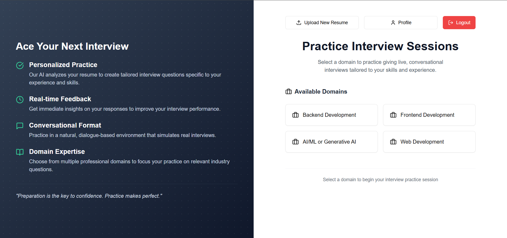
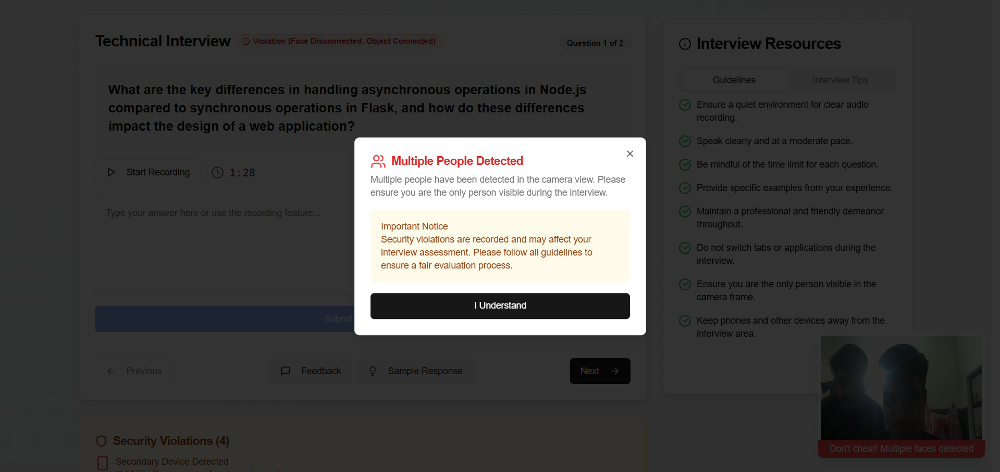
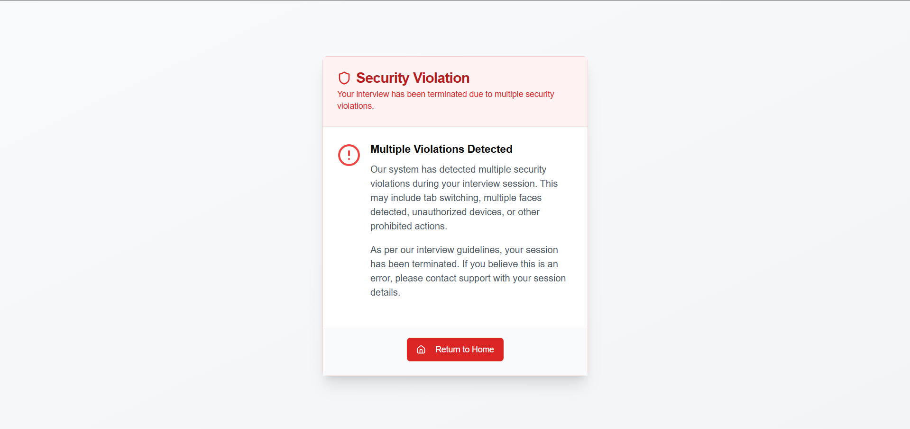
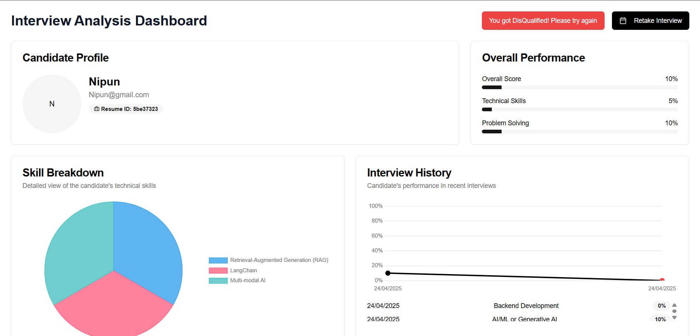

# HireXAI – Smart AI Interview & Recruitment Platform

## 🚀 Overview  
HireXAI is an AI-powered recruitment platform that automates interview scheduling, question generation, and real-time response evaluation. It uses Deepgram's Speech-to-Text for accurate transcriptions and ensures integrity through multi-face detection, eye tracking, and object detection using YOLO and CNN models.

Candidates receive detailed performance reports, while recruiters access insightful analytics and leaderboards for data-driven hiring decisions. HireXAI streamlines the hiring process with intelligent assessments and robust proctoring.  

## ✨ Features  
### 🧠 AI-Driven Interview System
- Resume-based dynamic question generation
- Real-time answer evaluation using NLP models
- Accurate speech-to-text transcription with **Deepgram**

### 🔐 Proctoring & Cheating Detection
- **Multi-Face Detection** – Flags multiple people in frame  
- **Object Detection** – Detects unauthorized items (e.g., phones)  
- All proctoring powered by **YOLO** model trained on specific data

### 📊 Candidate Performance Analysis
- Question-wise scoring and feedback
- Skill-based knowledge assessment
- Overall performance breakdown

### 📈 Recruiter Tools
- Leaderboard to rank candidates
- Interactive analytics dashboard
- Real-time interview monitoring
- Downloadable reports and insights

## 🏗️ Tech Stack  
- **Backend:** FastAPI
- **AI Models:** YOLO, CNN, OpenAI
- **Database:** MongoDB 
- **Frontend:** React.js
- **Deployment** AWS EC2

## Screenshots





















## 🔧 Installation  

### 1️⃣ Clone the Repository  
```sh
git clone https://github.com/Nipunkhattri/HirexAI
cd HirexAI
```

### 2️⃣ Create a Virtual Environment
```sh
python -m venv venv
source venv/bin/activate  # On macOS/Linux
venv\Scripts\activate  # On Windows
```

### 3️⃣ Install Dependencies
```sh
pip install -r requirements.txt
```

### 4️⃣ Run the Backend Server
```sh
uvicorn app:app --reload
```
